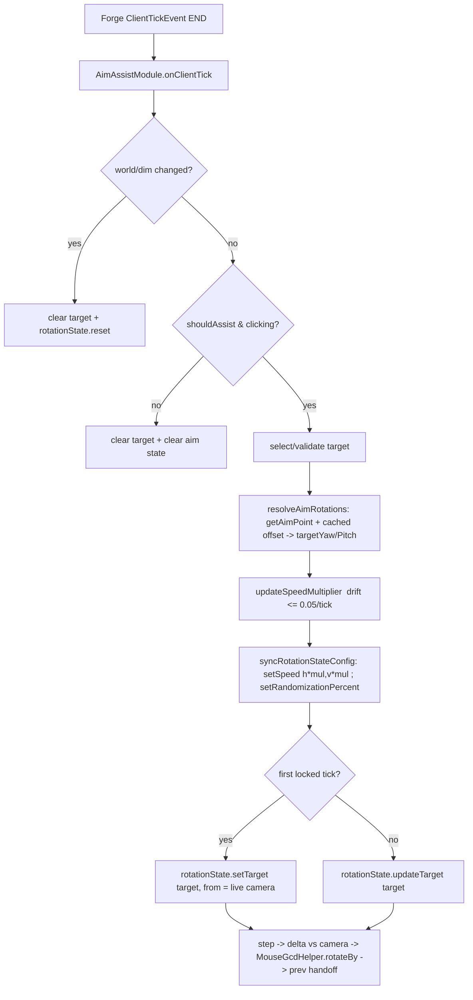

# Design Document

## Overview

This design enhances the existing `AimAssistModule` (package
`com.lionclient.feature.module.impl`) of LionClient, a client-side-only Minecraft 1.8.9
Forge mod. It is an enhancement of working code, not a rewrite.

AimAssist now has a **single rotation path**: the visible, client-side path that moves the
player's actual rotation via `MouseGcdHelper.rotateBy`, visibly turning the camera. The
previously selectable rotation "Mode" (the silent `SERVER` server-side path) has been
removed, along with all of its supporting state and logic. The two goals from the
requirements are:

1. **Feel/smoothness** — route the rotation path through the shared `RotationState` easing
   helper (currently dead code in this module), fix the render-interpolation handoff, and
   remove frame-rate inconsistencies and white-noise jitter sources.
2. **Detection realism** — vary the aim point inside the target hitbox instead of always
   aiming at the exact eye center, and drift speed randomization smoothly over time rather
   than re-drawing white-noise speed values each tick.

The work also removes dead/contradictory and now-removed-mode code
(`appliedYaw`/`appliedPitch`, `getSpeedMultiplier()`, `wasOvershooting`,
`syncPrevRotationSmooth`/`syncPrevRotation`, the `RotationMode` enum, the "Mode" setting,
`applyServerRotations`, `serverTargetYaw`/`serverTargetPitch`, and the SERVER-branch logic
in `onClientTick`) and tightens state hygiene on enable/disable and world change.

### Key research findings that shape the design

These were established by reading the current code:

- **`RotationState` is already the right engine and is already dead code here.**
  `AimAssistModule` constructs a `RotationState`, calls `reset()` on it, and never
  steps it. The rotation path instead carries its own bespoke easing
  (state machine `APPROACH`/`FINE_TUNE`/`LOCK`, hand-rolled acceleration limiting,
  per-axis noise). `RotationState` already provides exponential-decay easing,
  per-axis ratios, acceleration limiting, micro-drift, frame-rate-independent stepping
  via `step(deltaTimeSeconds)`, runtime setters (`setSpeed`, `setRandomizationPercent`),
  and a reused result buffer. `KillAuraModule`, `AntiFireballModule`, and `ClutchModule`
  already drive it with the `setTarget(...)` + `step(dt)` pattern. Consolidating
  AimAssist onto it is the lowest-risk way to satisfy Requirement 2.

- **`RotationState` needs two small, backward-compatible additions.**
  (a) It exposes only a single scalar `speed`, but AimAssist has independent
  `Horizontal Speed` and `Vertical Speed` settings. (b) Its `setTarget(...)` resets the
  interpolation `current` whenever the target moves more than 1° — which would reset
  easing progress every tick against a continuously moving target. Both are addressed by
  additive API (`setSpeed(yaw, pitch)` and `updateTarget(yaw, pitch)`) that leave existing
  callers byte-for-byte equivalent (see Components and Interfaces).

- **`MouseGcdHelper.rotateBy` already provides GCD alignment for the visible path.**
  Because the single rotation path applies its delta through `MouseGcdHelper.rotateBy`,
  rotations are inherently GCD-aligned exactly like vanilla mouse input. No separate
  server-side GCD handling is required by this design.

- **The `prevRotation` handoff is wrong.** `syncPrevRotationSmooth` moves
  `prevRotationYaw/Pitch` 70% toward the new rotation *after* applying the delta. Minecraft
  renders the camera as `prev + (current - prev) * partialTicks`. Collapsing the prev→current
  gap to 30% (and doing it at tick END) makes the rendered camera over/undershoot and can
  move opposite the tick's net delta, i.e. jitter. The correct handoff is to set `prev` to
  the camera rotation that existed *before* this tick's applied delta.

- **AimAssist never uses `getAimPoint`.** `getRotationsToEntity` computes yaw/pitch to the
  exact eye center every tick. `KillAuraRotationUtils.getAimPoint(entity, h, v, randomization, rng)`
  already implements gaussian randomization clamped inside the (border-expanded) bounding box,
  with an eye-center result when the eye is inside the box. Requirement 5 is satisfied by
  routing through it with a per-engagement cached offset.

- **Client ticks are fixed at 20 Hz.** `onClientTick` fires from
  `TickEvent.ClientTickEvent` (END phase), which is independent of render FPS. This is the
  single most important fact for Requirements 1.4 and 4: the *amount* of rotation per unit
  wall-clock is already FPS-independent because stepping is tick-driven, not frame-driven.
  Per-frame smoothness is Minecraft's job via render interpolation. This justifies keeping
  rotation tick-based (see Architecture → "Tick-based vs per-frame").

### Hard constraints (from AGENTS.md and Requirement 9)

- Java 8 only; MC 1.8.9 Forge APIs already referenced; no new third-party dependencies.
- Settings read at use-time (call `RotationState` runtime setters every tick).
- Full mutable-state reset in `onEnable`/`onDisable` and on world change.
- No per-frame heap allocation in render paths (AimAssist overrides no render path, so
  this is satisfied by construction; tick-rate allocation is acceptable but minimized).
- Validate with `compileJava` on a Java 8 JDK.

## Architecture

AimAssist keeps its existing place in the event pipeline. The only structural change is
that the per-tick rotation math now flows through the shared `RotationState` instance
instead of a private easing implementation, and there is now a single apply path.



`RotationState` is the single easing authority. The apply path `O` consumes the
`rotationState.step(deltaTime)` output; nothing computes easing, per-axis ratios, or
acceleration limiting by any other means (Requirement 2.1, 2.2).

### Downstream pipeline (unchanged)

- **Visible path**: `MouseGcdHelper.rotateBy(mc, yawDelta, pitchDelta)` applies a
  GCD-aligned delta to the real camera, exactly like vanilla mouse input. GCD alignment is
  provided entirely by this helper; the module does no separate snapping.

### Tick-based vs per-frame (design decision for Requirements 1 & 4)

Rotation stays on the client tick (20 Hz), not per render frame. Rationale:

- `ClientTickEvent` fires at a fixed 20 Hz regardless of FPS, so total rotation per unit
  wall-clock is inherently frame-rate independent. Passing the measured elapsed time to
  `RotationState.step(deltaTime)` additionally absorbs tick-timing jitter and lag spikes
  (clamped to `[0.001s, 0.1s]`), giving the convergence consistency Requirements 1.4 and
  4.3 demand.
- Per-frame *smoothness* is delivered by Minecraft's existing render interpolation
  (`prev + (current - prev) * partialTicks`). The only thing the module must do is hand off
  `prevRotationYaw/Pitch` correctly (Requirement 1.1/1.2), which this design fixes.
  `MouseGcdHelper.rotateBy` keeps the applied delta GCD-aligned, and render interpolation
  smooths it across frames.

Therefore: **keep tick-based stepping, scale every step by elapsed time inside
`RotationState`, and fix the prev-rotation handoff.** No new per-frame hook is introduced.

## Components and Interfaces

### 1. `RotationState` (combat) — additive, backward-compatible changes

Two additions; existing single-speed `setTarget(...)`+`step(...)` callers (KillAura,
AntiFireball, Clutch) are unaffected because equal yaw/pitch speeds reproduce the current
math exactly.

**New per-axis speed**

```java
// new fields, initialized to the scalar speed in the constructor
private float yawSpeed;
private float pitchSpeed;

/** Existing API retained; now also sets both axis speeds equal (no behavior change). */
public void setSpeed(float speed) {
    this.speed = MathHelper.clamp_float(speed, 1.0F, 30.0F);
    this.yawSpeed = this.speed;
    this.pitchSpeed = this.speed;
}

/** New: independent yaw/pitch convergence speeds for callers with split speed settings. */
public void setSpeed(float yawSpeed, float pitchSpeed) {
    this.yawSpeed = MathHelper.clamp_float(yawSpeed, 1.0F, 30.0F);
    this.pitchSpeed = MathHelper.clamp_float(pitchSpeed, 1.0F, 30.0F);
    this.speed = Math.max(this.yawSpeed, this.pitchSpeed); // used only for shared terms
}
```

`step(deltaTimeSeconds)` is updated to derive the per-axis decay and acceleration bound
from the per-axis speed instead of the single scalar:

```java
float kYaw   = 0.15F + yawSpeed   * 0.01F;
float kPitch = 0.15F + pitchSpeed * 0.01F;
float decayYaw   = 1.0F - (float) Math.exp(-kYaw   * fpsFactor);
float decayPitch = 1.0F - (float) Math.exp(-kPitch * fpsFactor);
float yawStep   = deltaYaw   * decayYaw   * yawRatio;
float pitchStep = deltaPitch * decayPitch * pitchRatio;
// per-axis acceleration limit, deg/second -> deg this step
float maxAccelYaw   = (180.0F + yawSpeed   * 12.0F) * deltaTime;
float maxAccelPitch = (180.0F + pitchSpeed * 12.0F) * deltaTime;
```

When `yawSpeed == pitchSpeed == speed` (every existing caller, which calls the single-arg
`setSpeed`), `decayYaw == decayPitch` and the per-axis accel bounds collapse to the current
single value — identical output. The currently-dead local `stepSize` is removed.

**New `updateTarget` (retarget without resetting interpolation progress)**

`setTarget` resets `current` (and `lastStep*`, `transitionTicks`, `sameTargetTicks`)
whenever the target moves more than 1°. AimAssist must update a continuously moving target
every tick while *preserving* `current` and `lastStep*` so that the acceleration limiter
remains continuous across ticks (Requirement 1.3) and the eased cursor keeps advancing
instead of being re-anchored each tick.

```java
/**
 * Redirect toward a new target WITHOUT resetting current position, last step,
 * or accumulated tracking ticks. Used when the locked target keeps moving and the
 * caller wants continuous easing (acceleration limiting stays continuous).
 */
public void updateTarget(float targetYaw, float targetPitch) {
    this.targetYaw = targetYaw;
    this.targetPitch = targetPitch;
    this.lastTargetYaw = targetYaw;
    this.lastTargetPitch = targetPitch;
    this.sameTargetTicks++;
}
```

`setTarget(...)` is still used exactly once per engagement — on the acquisition tick — to
anchor `current` to the live camera (Requirement 2.4). Every subsequent tick calls
`updateTarget(...)`.

### 2. `AimAssistModule` — fields

**Removed** (Requirement 6): `wasOvershooting`; the unused `smoothYaw`/`smoothPitch`;
`lastYawDelta`/`lastPitchDelta`, `lockTicks`, `playerCurrentYaw`/`playerCurrentPitch`
(superseded by `RotationState`'s internal state); the `getSpeedMultiplier()`,
`syncPrevRotationSmooth(...)`, `syncPrevRotation(...)` methods and their call sites; the
`RotationMode` enum and the "Mode" `EnumSetting`; the `applyServerRotations(...)` method;
the `serverTargetYaw`/`serverTargetPitch` fields; and the SERVER-mode branch in
`onClientTick`.

**Added / repurposed:**

```java
// --- Smoothly drifting speed multiplier (Req 3) ---
private float speedMultiplier = 1.0F;

// --- Per-engagement aim-point offset, normalized to half-extents (Req 5) ---
private EntityLivingBase aimOffsetTarget = null;
private double aimOffNormX = 0.0D, aimOffNormY = 0.0D, aimOffNormZ = 0.0D;
private boolean aimOffsetValid = false;

// --- Acquisition flag: setTarget once, updateTarget thereafter ---
private boolean aimStateInitialized = false;

// --- World-change detection (Req 8.3) ---
private int lastDimensionId = Integer.MIN_VALUE;
private net.minecraft.world.World lastWorld = null;
```

`isFirstLockFrame` is replaced by `aimStateInitialized` (inverse sense) so the meaning is
unambiguous: it gates `setTarget` vs `updateTarget` and aim-point offset regeneration.

### 3. `AimAssistModule` — method signatures and responsibilities

```java
// existing entry point; restructured to drive RotationState, single apply path
public void onClientTick(TickEvent.ClientTickEvent event);

// NEW: drift the speed multiplier (Req 3)
private void updateSpeedMultiplier();

// NEW: push current settings into RotationState every tick (Req 2.3, 2.5, 7.5)
private void syncRotationStateConfig();

// NEW: resolve target rotations via getAimPoint + cached per-engagement offset (Req 5)
private float[] resolveAimRotations(Minecraft mc, EntityLivingBase entity);

// CHANGED: now consumes rotationState.step(dt); correct prev handoff; NaN guard (Req 1)
private void applyPlayerRotations(Minecraft mc);

// CHANGED: clears the new fields too (Req 8)
protected void onEnable();
protected void onDisable();
```

`applyPlayerRotations` no longer takes `targetYaw/targetPitch` arguments; the target is set
on `rotationState` by `onClientTick` before dispatch, and the apply method reads
`rotationState.step(dt)`.

### 4. Interaction with `KillAuraRotationUtils` (unchanged APIs)

- `KillAuraRotationUtils.getAimPoint(entity, h, v, randomization, rng)` provides the
  hitbox-clamped gaussian aim point.
- `KillAuraRotationUtils.getRotationsToPoint(...)` converts an absolute aim point to
  yaw/pitch relative to the live camera.

The module no longer reads or writes `KillAuraRotationUtils.serverRotations[]` or interacts
with `ClientRotationHelper` server-rotation APIs, since the silent path has been removed.

## Data Models

### Per-tick control flow — common prologue

After the existing gating (`shouldAssist`, click-state, GUI check) and target
selection/validation succeed and a non-null `currentTarget` exists:

1. `float[] targetRots = resolveAimRotations(mc, currentTarget)`; if `null`, return.
2. `updateSpeedMultiplier()`.
3. `syncRotationStateConfig()` — reads settings at use-time:
   - `rotationState.setSpeed((float)(horizontalSpeed.getValue() * speedMultiplier),
     (float)(verticalSpeed.getValue() * speedMultiplier))`
   - `rotationState.setRandomizationPercent(noise.isEnabled() ? noisePercent.getValue() : 0f)`
   - `Smoothing`/`Smooth Factor %` modulate the effective speed multiplier handed to
     `setSpeed` (smoothing off ⇒ a high effective speed so the cursor converges almost
     immediately, still through `RotationState` — there is no alternate non-helper path).
4. Anchor or redirect:
   - if `!aimStateInitialized`: `rotationState.setTarget(targetRots[0], targetRots[1],
     mc.thePlayer.rotationYaw, mc.thePlayer.rotationPitch)`; `aimStateInitialized = true`.
   - else: `rotationState.updateTarget(targetRots[0], targetRots[1])`.
5. Dispatch to `applyPlayerRotations(mc)`.

`aimStateInitialized` is set back to `false` whenever the target becomes `null` or changes,
so each new engagement re-anchors `current` to the live camera (no snap).

### `applyPlayerRotations(mc)` (Requirements 1, 4, 6)

```
float dt = calculateDeltaTime();
float[] out = rotationState.step(dt);
if (out == null || !finite(out[0]) || !finite(out[1])) return;   // Req 1.5: skip, preserve prev

float beforeYaw   = mc.thePlayer.rotationYaw;     // interpolation start
float beforePitch = mc.thePlayer.rotationPitch;
float yawDelta   = MathHelper.wrapAngleTo180_float(out[0] - beforeYaw);
float pitchDelta = out[1] - beforePitch;

MouseGcdHelper.rotateBy(mc, yawDelta, pitchDelta);  // GCD-aligned camera move

// Correct render-interpolation handoff (replaces syncPrevRotationSmooth):
// prev = the rotation BEFORE this tick's delta, so the renderer interpolates
// monotonically prev -> current across partialTicks 0..1.
mc.thePlayer.prevRotationYaw   = beforeYaw;
mc.thePlayer.prevRotationPitch = beforePitch;

if (moveFix.isEnabled()) ClientRotationHelper.get().fixMovementInputs();
```

- **Req 1.1/1.2**: `prev` is set to the pre-delta camera rotation, not a 70% blend. Since a
  single `step` produces one signed delta per axis (bounded by the accel limit), the
  interpolated value advances monotonically with the sign of the tick's net delta.
- **Req 1.3**: acceleration limiting lives in `RotationState.step`, kept continuous across
  ticks by `updateTarget` (which preserves `lastStep*`).
- **Req 1.4 / 4.1 / 4.2 / 4.3**: the locked phase is just `step` near the target — the same
  `fpsFactor = deltaTime * 60` scaling as approach/fine-tune. There is no fixed per-tick
  drift fraction. Convergence is tick-driven (20 Hz) and elapsed-time scaled.
- **Req 1.5 / 4.4**: non-finite `step` output (or non-finite `dt`, already clamped by
  `calculateDeltaTime`) causes the tick to be skipped with `prev`/`current` preserved.
- GCD alignment is provided by `MouseGcdHelper.rotateBy`; when the GCD is near zero the
  helper no-ops, so the camera simply makes no move that tick.

### Hitbox aim-point variation — `resolveAimRotations(...)` (Requirement 5)

The aim point is randomized *per engagement* and held stable across consecutive same-target
ticks, which is the simplest construction that satisfies the consecutive-tick stability
bound (5.4) exactly (the randomization contributes zero inter-tick delta while the lock
holds) while still avoiding a constant dead-center fingerprint (5.1).

```
if (entity != aimOffsetTarget) {            // target changed -> recompute (Req 5.5)
    aimOffsetTarget = entity;
    aimOffsetValid = false;
}

float borderSize = entity.getCollisionBorderSize();
AxisAlignedBB bb = entity.getEntityBoundingBox().expand(borderSize, borderSize, borderSize);
double halfX = (bb.maxX - bb.minX) * 0.5D;
double halfY = (bb.maxY - bb.minY) * 0.5D;
double halfZ = (bb.maxZ - bb.minZ) * 0.5D;

if (halfX <= 0 || halfY <= 0 || halfZ <= 0) {  // degenerate box -> eye center fallback (Req 5.6)
    return rotationsToEyeCenter(mc, entity, bb); // retains previously valid behavior
}

if (!aimOffsetValid) {
    // One getAimPoint() draw per engagement, converted to a normalized offset so it
    // tracks the moving box. getAimPoint already clamps inside bb (Req 5.2).
    Vec3 p = KillAuraRotationUtils.getAimPoint(entity, hMultipoint, vMultipoint,
                                               AIM_POINT_RANDOMIZATION, rng);
    if (p == null) return rotationsToEyeCenter(mc, entity, bb);
    aimOffNormX = (p.xCoord - centerX(bb)) / halfX;   // each in [-1, 1]
    aimOffNormY = (p.yCoord - eyeCenterY(entity)) / halfY;
    aimOffNormZ = (p.zCoord - centerZ(bb)) / halfZ;
    // Zero offset resolves to eye center (Req 5.3)
    aimOffsetValid = true;
}

// Reconstruct absolute point from the cached normalized offset, clamped inside bb (Req 5.2)
double px = clamp(centerX(bb)     + aimOffNormX * halfX, bb.minX, bb.maxX);
double py = clamp(eyeCenterY(ent) + aimOffNormY * halfY, bb.minY, bb.maxY);
double pz = clamp(centerZ(bb)     + aimOffNormZ * halfZ, bb.minZ, bb.maxZ);

// Target prediction stays as-is and, when enabled, is applied to the aim point's base.
return KillAuraRotationUtils.getRotationsToPoint(px, py, pz,
        mc.thePlayer.rotationYaw, mc.thePlayer.rotationPitch);
```

- **Req 5.1**: aim point derives from `getAimPoint`'s gaussian randomization.
- **Req 5.2**: every coordinate is clamped inside `bb` both by `getAimPoint` and on
  reconstruction.
- **Req 5.3**: a zero gaussian offset (or `randomization <= 0.001`) yields eye center.
- **Req 5.4**: the normalized offset is constant while the same entity stays locked, so the
  aim-point contribution to the yaw/pitch delta between consecutive ticks is zero (≤ the GCD
  step trivially). Genuine target motion is the only inter-tick change and is handled by the
  easing/accel limit.
- **Req 5.5**: a different entity invalidates the cached offset and recomputes without the
  stability bound.
- **Req 5.6**: degenerate box, null aim point, or a point that cannot be constrained inside
  the box falls back to eye center and the previously valid rotation is retained.

`AIM_POINT_RANDOMIZATION` is a small constant (e.g. `0.15`) consistent with the gaussian
scale `KillAuraRotationUtils` already applies; it is not a per-frame allocation and is read
at use-time.

### Smoothly drifting speed multiplier — `updateSpeedMultiplier()` (Requirement 3)

```
if (!speedRandomization.isEnabled()) { speedMultiplier = 1.0F; return; } // Req 3.5

float min = (float)(speedRandMin.getValue() / 100.0);
float max = (float)(speedRandMax.getValue() / 100.0);

// Incremental drift from the previous tick's value, change <= 0.05 (Req 3.1, 3.2)
speedMultiplier += (rng.nextFloat() - 0.5F) * 0.1F;   // step in [-0.05, +0.05]

// Keep within [min, max], clamp back when settings change at runtime (Req 3.3)
speedMultiplier = MathHelper.clamp_float(speedMultiplier, min, max);
```

`speedMultiplier` is initialized in `onEnable` to `1.0` when `[min, max]` contains it, else
the nearest bound (Req 3.4).

### State hygiene (Requirement 8)

- `onEnable` resets, before any rotation is emitted: `currentTarget`, click/lock flags,
  `aimStateInitialized = false`, `speedMultiplier` (initialized to `1.0` if within
  `[min%, max%]`, else clamped to the nearest bound — Req 3.4), `aimOffsetValid = false`,
  `aimOffsetTarget = null`, `lastStepNanos = 0`, `rotationState.reset()`, and caches the
  current world/dimension. (Req 8.1.)
- `onDisable` clears `currentTarget`, resets smoothing/Speed_Multiplier state, and calls
  `rotationState.reset()`. The module no longer writes `ClientRotationHelper` server
  rotations or `KillAuraRotationUtils.serverRotations[]`, so there is nothing of that kind
  to clear. (Req 8.2.)
- **World/dimension change** is detected at the top of `onClientTick` by comparing
  `mc.theWorld` identity and `mc.thePlayer.dimension` against `lastWorld`/`lastDimensionId`.
  On change: clear `currentTarget`, `aimStateInitialized = false`, reset the aim offset,
  `rotationState.reset()`, and update the caches (Req 8.3). No rotation is emitted on that
  tick.
- While disabled, `onClientTick` returns immediately (`if (!isEnabled()) return;`), so no
  rotation is emitted (Req 8.4).

### Preserved behavior (Requirement 7)

Target selection (`findTarget` — closest-to-crosshair within FOV/Range), all gating checks
(`shouldAssist`, Only On Click, Weapon Only, Check Mode, Team/Friend/AntiBot/RayCast,
Move Fix, Target Invisibles, Target Prediction), immediate stop on mouse release, and the
GUI-open guard (`mc.currentScreen != null`) are retained unchanged. The only change to the
selection path is that the per-target rotation is computed via `resolveAimRotations`
(getAimPoint) instead of the eye-center-only `getRotationsToEntity`; `findTarget`'s scoring
continues to use crosshair angular distance. All settings continue to be read at use-time.

## Error Handling

- **Non-finite rotation** (`NaN`/`Infinity`) from `RotationState.step`: skip the rotation
  update for the tick and preserve current/previous rotation values (Req 1.5). The camera
  and `prevRotationYaw/Pitch` are left untouched.
- **Non-finite / zero elapsed time**: `calculateDeltaTime()` already clamps to
  `[0.001s, 0.1s]`; `RotationState.autoDeltaTime()` applies the same clamp on its fallback
  path (Req 4.4).
- **Near-zero GCD**: `MouseGcdHelper.rotateBy` no-ops when `gcd <= 1.0E-6` so the camera
  simply makes no move that tick.
- **Degenerate / null aim point**: `resolveAimRotations` falls back to eye center and
  retains the previously valid rotation (Req 5.6).
- **Scoreboard race conditions** in team checks remain wrapped in try/catch as today.
- **Reflection** for `curBlockDamageMP` remains guarded; failures fall back to no check.

## Testing Strategy

### Property-based testing is not applicable to this feature

PBT was assessed and deliberately excluded:

- **No new dependencies are permitted (Req 9.1).** A property-testing library
  (jqwik/QuickTheories/etc.) and a test runner (JUnit) would all be new third-party
  dependency declarations in `build.gradle`, which the requirement forbids.
- **No test harness exists.** The project has no `src/test` source set and is built with a
  pinned legacy ForgeGradle (`2.1-SNAPSHOT`) / Gradle 4.6 toolchain that must not be changed
  (Req 9.5). Standing up a test source set is itself out of scope and dependency-bearing.
- **Deep Minecraft runtime coupling.** The behaviors that vary with input
  (`MouseGcdHelper.currentGcd()`, `getAimPoint`) read `Minecraft.getMinecraft()`, the live
  player, world, and game settings, none of which exist outside a running client.

Per the workflow, the Correctness Properties section is therefore omitted. The invariants
below are still real and are verified by structured code review and in-game validation.

### Verifiable invariants (review + manual checks)

These are written as "for all" statements to guide review and manual testing, even though
they are not executed as automated property tests:

1. **Speed-multiplier drift (Req 3).** For every tick with speed randomization on,
   `|mul_t − mul_{t−1}| ≤ 0.05` and `mul ∈ [min%, max%]`; with it off, `mul == 1.0`.
2. **Monotonic interpolation (Req 1).** For every tick, `prev` equals the pre-delta
   camera rotation, so the rendered camera advances monotonically toward `current`.
3. **Aim point inside hitbox (Req 5).** Every resolved aim point lies on/inside the
   (border-expanded) bounding box; it is constant across consecutive same-target ticks.
4. **No alternate easing path (Req 2).** A grep for easing/accel/ratio math in
   `AimAssistModule` finds none outside `RotationState` calls.
5. **Single rotation path (Req 6).** A grep finds no `RotationMode`, "Mode" setting,
   `applyServerRotations`, `serverTargetYaw`/`serverTargetPitch`, `appliedYaw`/`appliedPitch`,
   `getSpeedMultiplier`, `wasOvershooting`, `syncPrevRotationSmooth`, or `syncPrevRotation`
   identifiers in the module.

### Manual in-game validation plan

- **Smoothness/FPS independence (Req 1.4, 4.3):** with Noise, Speed Randomization, and
  Random Skip Frames disabled, cap the client at 30, 60, 120, and 240 FPS and confirm the
  locked-on feel and convergence time are visually consistent (ticks are 20 Hz, so they
  should be).
- **Aim variation (Req 5):** confirm shots land at varied hitbox points across engagements
  and stay stable within a single engagement.
- **State hygiene (Req 8):** toggle the module, change worlds/servers, and release the
  mouse mid-engagement; confirm no residual rotation is emitted.
- **Settings at use-time (Req 7.5, 2.3):** change Horizontal/Vertical Speed and Noise
  sliders mid-engagement and confirm immediate effect without re-enabling.

### Build verification (Req 9)

- `JAVA_HOME=/usr/lib/jvm/java-8-openjdk-amd64 ./gradlew compileJava` must complete with
  zero errors and zero references to the removed identifiers (`appliedYaw`, `appliedPitch`,
  `getSpeedMultiplier`, `wasOvershooting`, `syncPrevRotationSmooth`, `syncPrevRotation`,
  `RotationMode`, `applyServerRotations`, `serverTargetYaw`, `serverTargetPitch`).
- No new dependency is added to `build.gradle`; only MC 1.8.9 Forge APIs already referenced
  by the module are used.
- AimAssist overrides no per-frame render path (`onRenderOverlay`/`onRenderWorld`), so the
  zero-per-frame-allocation rule is satisfied by construction; the `RotationState` result
  buffer is reused and tick-rate allocations are minimized.

## Requirements Traceability

| Requirement | Where addressed |
| :-- | :-- |
| 1.1, 1.2 Smooth/monotonic prev handoff | `applyPlayerRotations`: `prev = before*`; removal of `syncPrevRotationSmooth` |
| 1.3 Accel-bounded steps | `RotationState.step` accel limit, kept continuous via `updateTarget` |
| 1.4 FPS-consistent convergence | Tick-based stepping (20 Hz) + `step(deltaTime)` scaling |
| 1.5 NaN/Inf guard | Finite-check skip in the apply method |
| 2.1, 2.2 Single easing authority | All easing via `rotationState.step`; bespoke path removed |
| 2.3, 2.5 Settings at use-time | `syncRotationStateConfig` each tick (`setSpeed`, `setRandomizationPercent`) |
| 2.4 No-snap acquisition | `setTarget(target, liveYaw, livePitch)` on first locked tick only |
| 3.1–3.5 Drifting speed multiplier | `updateSpeedMultiplier`, `speedMultiplier` field, init in `onEnable` |
| 4.1–4.4 FPS-independent lock | Uniform `step` for all phases; `calculateDeltaTime` clamp |
| 5.1–5.6 Aim-point variation | `resolveAimRotations` via `getAimPoint` + cached normalized offset |
| 6.1–6.7 Dead-code & server-mode removal | Removed fields/methods/enum/setting listed in Components → fields |
| 7.1–7.5 Preserved targeting/gating | `findTarget`, `shouldAssist`, GUI guard, use-time reads retained |
| 8.1–8.4 State hygiene | `onEnable`/`onDisable`/world-change reset |
| 9.1–9.5 Build/perf constraints | No new deps, Java 8, no per-frame render path, pinned toolchain |
